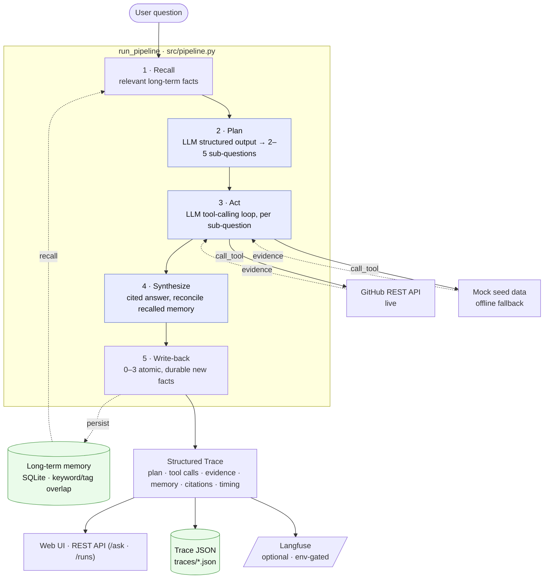

# Agentic RAG over Live Data & Memory

An agent that answers **multi-hop questions over a live, changing GitHub repo**
(issues, PRs, commits) — not a static PDF corpus. It decomposes a question into
sub-questions, calls tools to gather evidence, reconciles that against long-term
memory from prior sessions, and produces a **cited answer** — while emitting a
full structured **trace** of every step: `plan → tool calls → evidence → memory → answer`.

> **Status: working MVP (Phases 0–8).** The full pipeline runs end-to-end today,
> every run is **traced** (persisted as JSON, served from an HTTP API, with an
> optional Langfuse hook), and a **minimal web UI** renders each run's plan →
> tool calls → evidence → memory → cited answer in the browser. It is
> **provider-agnostic** (OpenAI / OpenRouter / xAI Grok) and, with no API key,
> degrades gracefully to a deterministic **offline path** so `make demo` always
> produces a complete trace. It's **live** at
> [agentic-rag-2dk7.onrender.com](https://agentic-rag-2dk7.onrender.com) (free
> Render tier) and ships as one container with a one-command DigitalOcean deploy.
> Live GitHub verification is the remaining integration step (see
> [Roadmap status](#roadmap-status)).

## Live demo

<!--
  Phase 8: the free Render deploy is LIVE below. Add a short screen-capture GIF here
  once captured — docs/assets/README.md has the exact capture checklist.

    
-->

### ▶ Live: [agentic-rag-2dk7.onrender.com](https://agentic-rag-2dk7.onrender.com)

Ask a question on the page and the run renders **answer-first**, followed by the
collapsible reasoning chain — **Plan → Tool Calls → Evidence → Memory Used** — with
every `[E#]` / `[M#]` citation clickable through to the matching evidence or memory
card. Same system as `make demo` locally; no install required.

> **Free-tier note.** The Render free web service **spins down when idle**, so the
> first request after a quiet spell cold-starts in ~30–60 s. It also has an
> **ephemeral filesystem** — long-term memory and persisted traces reset on
> redeploy/cold-start (the accepted demo trade-off noted under [Deploy](#deploy)).
> For no cold start and real-LLM answers, run `make demo` / `make dev` locally.

## What it does

Ask a multi-hop question like:

> *"What did we decide about the dashboard pagination fix, and is it still on track?"*

and the agent will:

1. **Recall** relevant facts from long-term memory (e.g. a decision captured in a prior session).
2. **Plan** — decompose the question into 2–5 ordered, tool-answerable sub-questions.
3. **Act** — for each sub-question, call the most appropriate tool (`search_issues`, `list_pull_requests`, `list_commits`, …) against the GitHub data source.
4. **Synthesize** a structured answer that cites every claim (`[E1]`, `[E2]`, …) and reconciles recalled memory (`[M1]`) against the current evidence.
5. **Write back** any durable new facts worth remembering in future sessions (selective, not "store everything").
6. **Trace** the whole run as an introspectable object (plan, tool-call args/results, evidence, memory read/written, citations, timings).

## Architecture



<details>
<summary>Plain-text version (for terminals / editors that don't render Mermaid)</summary>

```
                        ┌──────────────┐
   question ──────────▶ │  long-term   │  recall relevant facts
                        │   memory     │  (SQLite, keyword/tag overlap)
                        └──────┬───────┘
                               ▼
                        ┌──────────────┐
                        │   PLANNER    │  LLM structured output → 2–5 sub-questions
                        └──────┬───────┘  (offline: keyword heuristic)
                               ▼
                        ┌──────────────┐   ┌─────────────────────────┐
                        │    AGENT     │──▶│  TOOL LAYER             │
                        │ tool-calling │   │  GitHub REST (live) or  │
                        └──────┬───────┘   │  mock seed data (offline)│
                               │           └─────────────────────────┘
                               ▼  evidence (deduped in session memory)
                        ┌──────────────┐
                        │  SYNTHESIS   │  cited answer ([E1], [M1], …)
                        └──────┬───────┘  (offline: honest evidence digest)
                               ▼
                        ┌──────────────┐
                        │  WRITE-BACK  │  persist durable new facts
                        └──────┬───────┘
                               ▼
                     structured Trace object
              (plan · tool calls · evidence · memory · citations · timing)
```

</details>

Each stage is a separate module with a clear interface, so the data source or LLM
provider can be swapped without a rewrite. See [`docs/ARCHITECTURE.md`](docs/ARCHITECTURE.md).

| Module | Path | Responsibility |
|---|---|---|
| Planner | [`src/planner/`](src/planner/) | Question → ordered sub-questions (LLM structured output + heuristic fallback) |
| Tool layer | [`src/tools/`](src/tools/) | GitHub REST wrappers + mock seed tools, uniform `call_tool` interface |
| Agent | [`src/agent.py`](src/agent.py) | LLM tool-calling loop per sub-question |
| Memory | [`src/memory/`](src/memory/) | Long-term store (SQLite) + session memory + selective write-back |
| Synthesis | [`src/synthesis/`](src/synthesis/) | Cited answer generation, memory reconciliation |
| Pipeline | [`src/pipeline.py`](src/pipeline.py) | Shared orchestration (recall → plan → tools → synthesis → write-back → Trace), driven by both demo + API |
| Tracing | [`src/tracing/`](src/tracing/) | Pydantic `Trace` model + JSON persistence (`store.py`) + optional Langfuse emit (`observability.py`) |
| LLM config | [`src/llm.py`](src/llm.py) | Provider-agnostic client (OpenAI / OpenRouter / Grok) |
| API | [`src/api/`](src/api/) | FastAPI app — `POST /ask`, `GET /runs`, `GET /runs/{run_id}`, `/health` |
| Frontend | [`frontend/`](frontend/) | No-build single-page trace viewer (HTML + vanilla JS), served by the API |

## Quickstart

Requires **Python 3.11+**.

```bash
# 1. Install deps and create .env from the template
make setup

# 2. Run the end-to-end demo (3 multi-hop questions, full trace printed)
make demo

# 3. Run the test suite
make test
```

> On Windows without `make`, call the venv Python directly, e.g.
> `.venv/Scripts/python.exe -m src.demo` and `.venv/Scripts/python.exe -m pytest tests/ -q`.

`make demo` works **with no API key** — it runs the deterministic offline path and
still prints a complete plan → evidence → cited answer → trace for all three
questions, including a cross-session memory-recall scenario. Set a real LLM key
(below) for genuine LLM-driven planning, tool-calling, and analytical synthesis.

## LLM provider configuration

The pipeline talks to its LLM through the OpenAI SDK, which speaks to **any
OpenAI-compatible provider** — so switching providers is pure `.env` config, no
code change. Configure it in `.env` (see [`.env.example`](.env.example)):

| Variable | Purpose |
|---|---|
| `LLM_API_KEY` | Provider API key. Overrides `OPENAI_API_KEY` if set. |
| `LLM_BASE_URL` | OpenAI-compatible endpoint. Leave unset for OpenAI. |
| `LLM_MODEL` | Model id (default `gpt-4o-mini`). |
| `LLM_TIMEOUT` | Per-request timeout in seconds (default `30`). Bounds a stuck provider. |
| `LLM_MAX_RETRIES` | SDK retry cap (default `1`). |

**OpenAI** (default) — just set `OPENAI_API_KEY`.

**OpenRouter** (has a genuinely free tier):

```dotenv
LLM_API_KEY=sk-or-v1-your-key
LLM_BASE_URL=https://openrouter.ai/api/v1
LLM_MODEL=openrouter/free
```

`openrouter/free` is an auto-router that spreads each call across many free
backends, so it sidesteps any single provider's rate limit — more reliable for
a multi-call run than pinning one free model (which shares an upstream quota pool
and returns HTTP 429 under load). You can still pin a specific model
(e.g. `google/gemini-2.0-flash-exp:free`) if you prefer deterministic routing.

**xAI Grok:**

```dotenv
LLM_API_KEY=xai-your-key
LLM_BASE_URL=https://api.x.ai/v1
LLM_MODEL=grok-2-latest
```

> The planner (structured output) and agent (tool-calling) need a model that
> supports those features — the Grok models and the capable free models the
> router selects do. If a chosen model lacks them, returns empty content, or is
> slow, that stage falls back to the deterministic path automatically; the demo
> never crashes. Every LLM call site is wrapped so any auth/rate-limit/network
> error degrades to the offline path, and the client uses a bounded per-request
> timeout (`LLM_TIMEOUT`, default 30s) so a stuck provider can't hang the run
> (resilience locked in by [`tests/test_resilience.py`](tests/test_resilience.py)).

## Data source

The data source is **GitHub** (issues, PRs, comments, commits on a repo you own),
accessed via a repo-scoped fine-grained PAT. `GITHUB_MCP_MODE` in `.env` selects
the access mode; with the sentinel values it runs entirely on **mock seed data**,
so the demo is fully self-contained offline. Point `GITHUB_REPO` only at a repo
you control. See [`docs/PROJECT_BRIEF.md`](docs/PROJECT_BRIEF.md) for the rationale.

## HTTP API

`make dev` (or `uvicorn src.api.main:app --reload`) serves the pipeline over HTTP:

| Method & path | Purpose |
|---|---|
| `POST /ask` | Run the full pipeline for `{"question": "..."}` and return the complete `Trace` (plan, tool calls, evidence, memory, cited answer, timings). The run is also persisted and emitted to observability. |
| `GET /runs` | List summaries of every persisted run, newest first. |
| `GET /runs/{run_id}` | Fetch one run's full `Trace` JSON (`404` if unknown). |
| `GET /health` | Liveness + current build phase. |

Every run's `Trace` is persisted as JSON under `TRACE_DIR` (default `./traces`,
gitignored), so a run is retrievable from this API independent of any third-party
dashboard — that's the always-on half of observability. If `LANGFUSE_PUBLIC_KEY`
+ `LANGFUSE_SECRET_KEY` are set, each run is *also* emitted to a Langfuse
dashboard (one trace with planner / tool / synthesis spans); with no keys that
hook is a verified no-op, so the API and demo run identically offline.
Interactive OpenAPI docs are served at `/docs` while the server is running.

## Web UI

`make dev`, then open **<http://localhost:8000/>**. Type a question (or click an
example chip) and the page renders the run **answer-first**, followed by the
reasoning chain as collapsible sections — Plan, Tool Calls, Evidence, Memory
Used. Every `[E#]` / `[M#]` citation in the answer is a link: it opens the right
section, scrolls to and flashes the matching evidence or memory card, and an
evidence card with a source URL links out to the GitHub issue / PR / commit. A
**Recent runs** strip lists past runs (`GET /runs`) and loads any of them in full
(`GET /runs/{run_id}`).

It's a single no-build static page (`frontend/index.html` + `app.js` +
`styles.css`) that the FastAPI app serves itself, so the whole thing ships as one
container. Like the rest of the system it works **offline** — with no LLM key the
page still shows a complete plan → evidence → cited answer from the fallback path.

## Deploy

The whole system — JSON API **and** static UI — ships as **one container** (a
single Uvicorn process), built from a multi-stage, non-root image
([`infra/Dockerfile`](infra/Dockerfile)).

```bash
# Build the image (from the repo root; the Dockerfile lives in infra/)
make docker-build

# Run it offline with zero config → http://localhost:8000/ (deterministic fallbacks)
make docker-run

# Or run with local persistence (memory + traces on a named volume) via compose
make compose-up          # docker compose -f infra/docker-compose.yml up --build
```

**DigitalOcean App Platform** is the target host. The spec lives in
[`infra/do-app.yaml`](infra/do-app.yaml) and deploys with one command once the
[`doctl`](https://docs.digitalocean.com/reference/doctl/) CLI is authenticated
(`doctl auth init`) and your GitHub repo is connected:

```bash
make deploy              # doctl apps create --spec infra/do-app.yaml --upsert
```

The committed spec ships only **offline-safe sentinels** (`sk-change-me`, …), so a
fresh deploy comes up green on the fallback path with **no real secrets in git**;
`.dockerignore` keeps `.env` out of the build context entirely. Add real,
Encrypted values (`LLM_API_KEY`, `GITHUB_TOKEN`, Langfuse keys) in the DO
dashboard to light up live LLM / GitHub / observability. Full walkthrough and the
App-Platform-vs-droplet trade-off in [`docs/DEPLOYMENT.md`](docs/DEPLOYMENT.md).

> **Known limitation.** App Platform's filesystem is ephemeral, so long-term
> memory (SQLite) and persisted traces reset on every redeploy — an accepted
> demo trade-off. `make compose-up` persists them on a named volume locally;
> attaching a DO volume or Managed Postgres would persist them in production.

### Free tier: Render

Prefer a free public URL? The **same container** deploys to [Render](https://render.com)
from a committed Blueprint ([`render.yaml`](render.yaml)) — no CLI, no cost:

> Render dashboard → **New → Blueprint** → connect this repo → it reads `render.yaml`.

It builds `infra/Dockerfile`, binds Render's injected `$PORT`, health-checks `/health`,
and ships the same **offline-safe sentinels**, so a fresh deploy comes up green on the
fallback path with no real secrets in git. Add real values (`LLM_API_KEY`, …) as
**secrets** in the Render dashboard to light up live LLM / observability.

> **Free-tier caveats.** The service **spins down when idle** (first request after a
> cold start takes ~a minute) and the filesystem is **ephemeral** (memory + traces
> reset on redeploy / cold start) — same accepted demo trade-off as App Platform.
> A Render Disk at `/data` (paid) or Managed Postgres persists them.

> **Why not Vercel / serverless?** This is a long-running ASGI web service with
> on-disk SQLite memory and multi-second LLM calls — it needs a persistent process,
> not short-lived serverless functions, so Render / App Platform / Fly.io / a droplet
> are the right fits, not Vercel's function runtime.

## Repo layout

```
agentic-rag-project/
├── docs/            PROJECT_BRIEF · ARCHITECTURE · ROADMAP · DEPLOYMENT
├── src/
│   ├── planner/     question decomposition
│   ├── tools/       GitHub REST + mock tool wrappers
│   ├── memory/      long-term (SQLite) + session memory + write-back
│   ├── synthesis/   cited answer generation
│   ├── tracing/     Trace models + JSON store + Langfuse emit
│   ├── api/         FastAPI app (/ask · /runs · /health)
│   ├── agent.py     LLM tool-calling loop
│   ├── llm.py       provider-agnostic LLM client
│   ├── pipeline.py  shared orchestration (demo + API)
│   └── demo.py      end-to-end CLI runner
├── frontend/       no-build trace viewer (index.html · app.js · styles.css)
├── infra/          Dockerfile · docker-compose · DigitalOcean app spec
├── render.yaml      Render Blueprint (free-tier deploy, same container)
├── scripts/         seed helpers
├── tests/           pytest suite
├── .dockerignore    keeps .env + build bloat out of the image
├── .env.example     all env vars documented
└── Makefile         setup · dev · demo · test · docker · deploy
```

## Roadmap status

Full detail (with "definition of done" per phase) in [`docs/ROADMAP.md`](docs/ROADMAP.md).

| Phase | Scope | Status |
|---|---|---|
| 0 | Scaffolding, FastAPI `/health`, Makefile | ✅ Done |
| 1 | Hardcoded pipeline over seed data + synthesis + trace | ✅ Done |
| 2 | LLM-driven planner + real tool-calling | ✅ Done |
| 3 | Live GitHub data source | 🟡 REST tool layer built; live verification deferred (mock fallback works) |
| 4 | Long-term + session memory, selective write-back, cross-session recall | ✅ Done |
| 5 | Observability — persisted Trace JSON + HTTP API to retrieve runs; optional Langfuse hook | ✅ Done (JSON + API verified; Langfuse hook wired, add a key to light it) |
| 6 | Minimal web UI (question → expandable trace) | ✅ Done |
| 7 | Dockerize + deploy to DigitalOcean | 🟡 Containerized; one-command DO deploy (`make deploy`). Public URL achieved on a free Render tier — see [Live demo](#live-demo) |
| 8 | Polish — architecture diagram, design-decisions writeup, demo-data cleanup | 🟡 Diagram + writeup + clean demo data + **live URL** done; demo GIF is the last hand-off |

## Design decisions

The three questions a reviewer tends to ask — *why this memory design, why a linear
planner, and what would you change to scale it* — answered directly.

### Why this memory design (selective, not "store everything")

Memory is a **write-back policy**, not a log. After each run, synthesis proposes
**0–3 atomic, durable facts** — each gated by "would this still be useful to recall
in two weeks?" — and they're inserted only if they survive a **Jaccard token-overlap
dedup** (≥ 0.6) against what's already stored. Transcripts and raw tool output are
never persisted. Retrieval into the planner uses the same lightweight **keyword /
topic-tag overlap** (tags weighted double), returns only entries with non-zero
overlap, and is capped at the top-k — the planner sees what's *relevant*, not the
whole store. A hard `MAX_ENTRIES` cap evicts oldest-first so the store can't grow
without bound ([`src/memory/store.py`](src/memory/store.py)).

The point being demonstrated is the **policy** — what's worth remembering and how
recalled facts get reconciled and cited against fresh evidence — so it runs
identically online and offline with **zero infrastructure and no embeddings**. The
trade-off is explicit: keyword overlap misses paraphrases a vector search would
catch. The store's interface is deliberately narrow (`add` / `retrieve` / `all`) so
swapping in Postgres + pgvector is a drop-in, not a rewrite.

### Why the planner is linear, not a DAG

Each sub-question in a plan is **independently answerable**, so the executor is a
simple ordered loop. That's a deliberate choice for this system's actual goal — an
**introspectable trace**: a flat `plan → tool calls → evidence → answer` sequence is
something a non-technical reviewer can read top-to-bottom, which is the centerpiece
of the demo. A DAG would buy parallel fan-out and *dependent* sub-questions (step 3
consumes step 2's output), but it costs scheduling, partial-failure handling, and —
most relevant here — trace legibility. It's the **first thing I'd change** once
questions genuinely need one sub-answer to shape the next; the planner already emits
a structured plan object, so the executor could grow dependency edges without
touching the planner's interface.

### Always a working demo path

Every LLM call site (planner, agent, synthesis) is wrapped so that an empty,
malformed, slow, or errored completion **degrades to a deterministic fallback**
instead of crashing — backed by a bounded per-request timeout and
[`tests/test_resilience.py`](tests/test_resilience.py). This is visible in the live
demo: when the free model router returns junk for the structured-output planner call,
the run quietly falls back to the keyword heuristic and still produces a complete,
cited trace. The system is demoable with zero credentials and is never left in a
broken state.

### What I'd change to scale this to production

- **Memory:** SQLite → **Postgres + pgvector** for semantic retrieval and concurrent
  writers; add recency decay and per-fact provenance so recalled facts are auditable.
- **Planner:** linear → **DAG** with parallel independent branches and a *replan*
  step when a tool returns nothing (currently the step just yields no evidence).
- **Tool layer:** widen the GitHub surface, add response **caching + rate-limit
  backoff**, and move to a generic MCP client so a new data source is config, not code.
- **Persistence:** App Platform's filesystem is ephemeral, so memory + traces reset
  on redeploy — attach a **DO volume or Managed Postgres** to persist them in prod.
- **Observability → evaluation:** the Langfuse hook is wired; the next step is a
  **golden-question eval harness** in CI that regresses answer quality and citation
  coverage, so changes to the planner/prompt can't silently degrade output.
- **Cost / latency:** cache planner + tool results and split models — a small, cheap
  model for planning and tool selection, a stronger one reserved for synthesis.

## License

MIT
